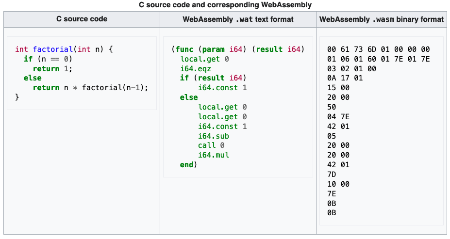

# Time for Tech: WASM + Svelte
## (and a little bit of Rust)
---
# WWW

- **What?**  WASM (Rust) + Component Framework (Svelte)
- **Why?**
  - Svelte by word of mouth, web frameworks feel more and more heavy
  - Understand WASM hype
  - Interest in Rust
  - Found tutorial that connects all the above 🎉
- **Where?** ->  [Github](https://git.daimler.com/olhagel/Rust-WASM-Svelte-Playground)
---
# WASM Basics

- Binary format
- 40+ "source" languages
- Runtime environments ("virtual stack machines") with AOT/JIT or interpreted
- "really portable" (now srsly!)
- W3C maintained
---
## WASM History

- [asm.js](http://asmjs.org/) (since 2013):
  - regular JS code (subset)
  - statically typed (with JS tricks) - only 4 types
  - from C via [https://emscripten.org/](https://emscripten.org/) (+ lot of other lanugages supported)
  - approx. 2x times slower than C
  - Browsers had special optimizations for it
  - (considered) deprecated due to WASM
---
## WASM formats

---
## WASM Runtimes

- [Browser](https://www.lambdatest.com/web-technologies/wasm): JS interaction via pointers & copies(!)
- [WAVM](https://github.com/WAVM/WAVM): compiles to real machine code (with help of standard C toolchain LLVM)
- [Wasmtime](https://github.com/bytecodealliance/wasmtime): standalone runtime; focus on security (Linux, macOS)
- [Wasmer](https://docs.wasmer.io/): server runtime, can convert in [OS-native executables](https://www.heise.de/news/WebAssembly-Wasmer-3-0-erstellt-native-Executables-fuer-Windows-Linux-und-macOS-7351531.html)
- [WasmEdge](https://wasmedge.org): runtime with focus on cloud ([language support](https://wasmedge.org/book/en/write_wasm.html))

---
## WASM Runtimes 2

- [Docker](https://www.docker.com/blog/docker-wasm-technical-preview/) tech preview (Beta, based on WasmEdge)
    > _If WASM+WASI existed in 2008, we wouldn't have needed to create Docker. (Docker Co-Founder)_
- [Kubernetes](https://wasmedge.org/book/en/use_cases/kubernetes.html) (via WasmEdge)
- [AWS Lambda](https://www.secondstate.io/articles/webassembly-serverless-functions-in-aws-lambda/)
- ...

---
### Use Cases ([native code "everywhere"](https://webassembly.org/docs/use-cases/))
- from asm.js: OpenGL/WebGL, SQLite, gnuplot, Unreal 3/4 engine (3 in 4 days!), ScummVM, [Doom](https://kripken.github.io/boon/boon.html)
- Simulation, image/sound/video processing, visualization, animation, compression, crypto mining
- e.g. [Unity3D](https://docs.unity3d.com/2020.1/Documentation/Manual/webgl-gettingstarted.html) / [Disney+ Client App](https://medium.com/disney-streaming/introducing-the-disney-application-development-kit-adk-ad85ca139073) for set top boxes (due to browser zoo; Rust -> WASM + own runtime)
- Edge computing: Vercel, Shopify, Cloudflare already with support
- Static UI + light-weight SSR backend in WASM (instead of client / server)
---
## WASM Tooling
- Parallel text format (wat) for debugging and viewing in browser and tools
- [WAPM](https://wapm.io/): Package Registry
- [WASI](https://github.com/bytecodealliance/wasmtime/blob/main/docs/WASI-intro.md): Web Assembly System Interface to OS features (standard proposal), needs Wasmtime/browser polyfill; so far only usable from Rust & C/C++
- [AssemblyScript](https://www.assemblyscript.org/): Type-script-like syntax
- [WebAssembly.sh](https://webassembly.sh/): Online shell for WASM modules
---
## Why Rust + WASM

- Rust recommends WASM when coding for the web: [https://www.rust-lang.org/what/wasm]([https://www.rust-lang.org/what/wasm)
- offers [access to Web APIs](https://docs.rs/web-sys/0.3.60/web_sys/) (and thus DOM access)
---
# Time for some code...

---
# Svelte

- [Svelte](https://www.merriam-webster.com/dictionary/svelte) = slender / sleek
- _"Frameworks are not tools for organising your code, they are tools for organising your mind."_
- _"Svelte is a language."_ ([Rich Harris](https://gist.github.com/Rich-Harris/0f910048478c2a6505d1c32185b61934))
- _"Death to boilerplate"_
---
## Svelte Basics

- Initiated by [Rich Harris](https://twitter.com/rich_harris) (React framework Next.JS at Vercel)
- Current version: 3
- **Compiles** to pure "highly optimized" JS
  (thus can be easily adapted to new compilation concepts / JS features)
- Everything unnecessary removed completely at compilation
- Max **compact** code ([in comparison with e.g. React](https://blog.scottlogic.com/2021/01/18/philosophy-of-svelte.html))
- Paradigm: **as less boilerplate as possible**
- Few "slim" concepts (e.g. reactivity on [4 short pages](https://svelte.dev/tutorial/reactive-assignments), tutorial 1-2 days)
---
## Svelte Core Concept

  >_Svelte is a compiler that knows at build time how things could change in your app, rather than waiting to do the work at run time._
  (https://svelte.dev/blog/virtual-dom-is-pure-overhead)
- **Performant**: keep track of which values are dependant upon other values instead virtual DOM comparison which can be expensive:
  - traversing DOM tree, diffing, suboptimal coding can lead to unnecessary re-calculations, ...

---
<!-- _header: '' -->
<!-- _footer: '' -->

---
## [Framework Retention](https://2021.stateofjs.com/en-US/libraries/front-end-frameworks/)

---
## Comparison

- Angular, Vue & React = running on client side / shadow DOM
  - regarding SFC (single file components) similar to Vue
  - more compact code (["Death to boilerplate"](https://svelte.dev/blog/write-less-code)) - especially in comparison to React, but also to Vue
  - some same (e.g. Slots, onMount/tick) as Vue
  - Example: [decision for Vue2 -> Svelte](https://escape.tech/blog/from-vue2-to-svelte/)  (instead Vue3)
- [SolidJS](https://www.solidjs.com/): similar core concept; more boilerplate; aims at React
- RealWorld example: https://github.com/sveltejs/realworld
  - BTW: [RealWorld CodeBase](https://codebase.show/projects/realworld) is awesome!
---
# Time for some code...

---
# Tooling

- **[SvelteKit](https://kit.svelte.dev/)** (currently: stable RC)
  - Scaffolding
  - Routing, Layouts (common UI areas like Header, Footer), SSR (default)
  - Code-splitting per route (thus performance)
  - based on Vite
  - Good overview can be found [here](https://www.sitepoint.com/a-beginners-guide-to-sveltekit/)
- [Svelte Native](https://svelte-native.technology/) - based on [NativeScript](https://nativescript.org/)
---
## UI Components Libs
- [Svelte Material UI](https://sveltematerialui.com/)
  - Components can be used stand-alone (besides theming)
- [Carbon Components](https://carbon-components-svelte.onrender.com)
- [Svelte Frameworks and Shocases](https://madewithsvelte.com/)
---
## Where to go afterwards

- [10 reasons for Svelte](https://markushatvan.com/blog/10-reasons-why-i-recommend-svelte-to-every-new-web-developer)
- [Svelte Interactive Tutorial](https://svelte.dev/tutorial) incl direct JS/CSS output
- [Svelte Kit Tutorial](https://learn.svelte.dev/): for Svelte and SvelteKit
- [Svelte Examples](https://svelte.dev/examples)
- Online interactive editors:
  - [REPL](https://svelte.dev/repl)
  - [StackBlitz](https://node.new/svelte)