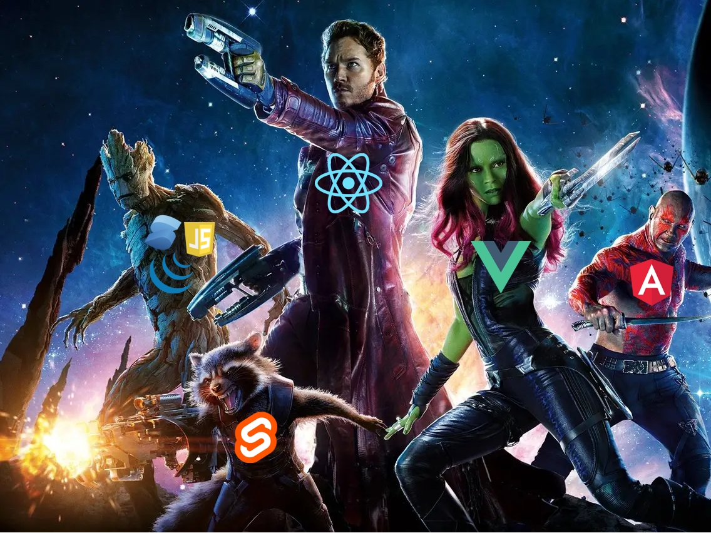

# Svelte in a nutshell

[Svelte](https://www.merriam-webster.com/dictionary/svelte) means slender / sleek

>_"Frameworks are not tools for organising your code, they are tools for organising your mind."_

>_"Svelte is a language."_ ([Rich Harris](https://gist.github.com/Rich-Harris/0f910048478c2a6505d1c32185b61934))

>_"Death to boilerplate"_

>_In other words, frameworks aren’t there to help browsers run your app; they’re there to help developers create the app. Any application could, in theory, be written in pure JavaScript, and the browser would happily run it. Because of this, Svelte gives you a framework and tools to use for developing, and then “magically disappears” at build time.
(From the ["Philosophy of Svelte"](https://blog.scottlogic.com/2021/01/18/philosophy-of-svelte.html))_

## Basics
- Initiated by [Rich Harris](https://twitter.com/rich_harris) (worked also on React framework Next.JS at Vercel)
- Current version: 3
- **compiles** to pure "highly optimized" JS
  - can be easily adapted to new compilation concepts / JS features
- everything not needed is removed completely at compilation
- **compact** code ([in comparison with e.g. React](https://blog.scottlogic.com/2021/01/18/philosophy-of-svelte.html))
- as less boilerplate as possible
- few "slim" concepts - e.g. reactivity on [4 short pages](https://svelte.dev/tutorial/reactive-assignments)
  - Whole tutorial can be read in approx 1-2 days
- **performant**: forward referencing to keep track of which values are dependant upon other values instead virtual DOM comparison which can be expensive:
  - traversing DOM tree, diffing, suboptimal coding can lead to unnecessary re-calculations, ...
  >   Svelte is a compiler that knows at build time how things could change in your app, rather than waiting to do the work at run time.
  - [Benchmarks](https://krausest.github.io/js-framework-benchmark/2022/table_chrome_108.0.5359.71.html)
  - Why? https://svelte.dev/blog/virtual-dom-is-pure-overhead
- CSS scoped to component. Not used? Warning + compiler removes it
- Component isolation: no event bubbling, top down data flow (but can be easily changed)

## Comparison

### JS Framework Retention

([JS Framework Retention 2022](https://2021.stateofjs.com/en-US/libraries/front-end-frameworks))
### In short
- Not really comparable to Angular, Vue & React - cause those are frameworks based on shadow DOM that are delivered & run on client side
  - but regarding SFC (single file components) similar to Vue
  - very compact code (["Death to boilerplate"](https://svelte.dev/blog/write-less-code)) - especially in comparison to React, but also to Vue
  - Example [decision for Vue2 -> Svelte](https://escape.tech/blog/from-vue2-to-svelte/) (instead Vue3)
  - many same (e.g. Slots, onMount/tick) as Vue
- [SolidJS](https://www.solidjs.com/): similar core concept; more boilerplate; aims at React
- RealWorld example: https://github.com/sveltejs/realworld
  - BTW: [RealWorld CodeBase](https://codebase.show/projects/realworld) is awesome for comparisons!

## Adoption
Companies using Svelte (somewhere)
- Spotify
- Philips
- IBM
- Rakuten
- New York Times
- Avast
- Apple
- ...

## Tooling
- Debugging directly _*.svelte_ files in Browser
- **[SvelteKit](https://kit.svelte.dev/)**
  - Scaffolding
  - Routing, Layouts (common UI areas like Header, Footer), SSR (default), Pre-Rendering/Loading
  - easy to write server-side code
  - Code-splitting per route (thus performance)
  - [Adapters](https://kit.svelte.dev/docs/adapters) for target platforms (e.g. Node, Cloudflare Pages)
  - based on Vite
  - Good overview can be found [here](https://www.sitepoint.com/a-beginners-guide-to-sveltekit/)
  - **in short**: makes Svelte ready for complex and demanding apps
- [Svelte Native](https://svelte-native.technology/) - based on [NativeScript](https://nativescript.org/)
- [Svelte and Typescript](https://github.com/ivanhofer/sveltekit-typescript-showcase)

## Frameworks
- [Svelte Material UI](https://sveltematerialui.com/)
  - Components can be used stand-alone (besides theming)
- [Carbon Components](https://carbon-components-svelte.onrender.com)
- [Svelte Frameworks and Shocases](https://madewithsvelte.com/)

## More nice things
- easy to use JS plugins - just import and use
- Await directly in [templates](https://svelte.dev/tutorial/await-blocks)
- Compiler optimizes even not recommendable code (e.g. inline event handlers)
- [Accessibility Checks](https://svelte.dev/docs#accessibility-warnings)
- Events
  - [Event Modifiers](https://svelte.dev/tutorial/event-modifiers)
  - Default: no bubbling, but can be easily activated [per event](https://svelte.dev/tutorial/event-forwarding)
- [Global Stores]( https://svelte.dev/tutorial/writable-stores) / State Management
- Animations
  - ["Tweened"](https://svelte.dev/tutorial/tweened) built-in animations on values
  - [Transitions](https://svelte.dev/tutorial/transition) for fading/CSS animations
- [Advanced CSS styling support](https://svelte.dev/tutorial/classes)
- [Recursive components](https://svelte.dev/tutorial/svelte-self)
- Svelte Components can be exported as [Web Components](https://blog.logrocket.com/build-web-components-svelte/) 

## Where to go afterwards
- [10 ressons for Svelte](https://markushatvan.com/blog/10-reasons-why-i-recommend-svelte-to-every-new-web-developer)
- [Svelte Interactive Tutorial](https://svelte.dev/tutorial) incl direct JS/CSS output
- [Svelte Kit Tutorial](https://learn.svelte.dev/): for Svelte and SvelteKit
  - [Svelte Kit 1.0 is out](https://www.youtube.com/watch?v=uEJ-Rnm2yOE)
- [Svelte Examples](https://svelte.dev/examples)
- Online interactive editors:
  - [REPL](https://svelte.dev/repl)
  - [StackBlitz](https://node.new/svelte)
