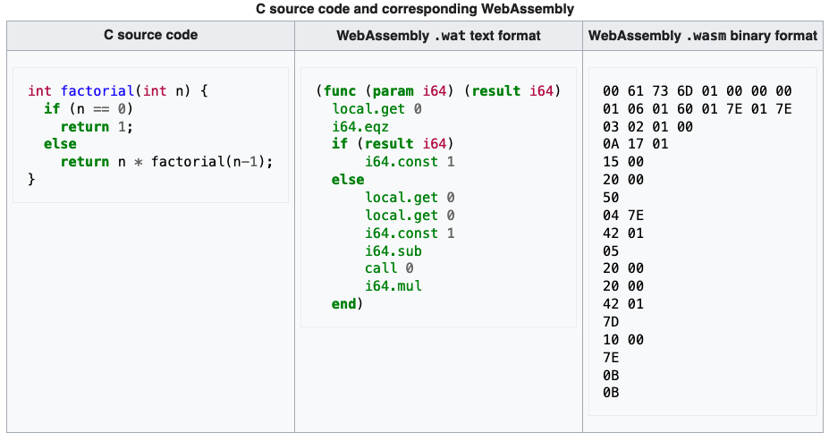

# WASM in a nutshell

## History
- [asm.js](http://asmjs.org/) (since 2013):
  - Regular JS code (subset) mittels
  - statically typed (with JS tricks) - only 4 types
  - aus C mittels [https://emscripten.org/](https://emscripten.org/) (a lot of other lanugages supported)
  - approx. 2x times slower than C (but much faster than JS due to types + no GC)
  - Browser have special optimizations for it
  - (Considered) deprecated due to WASM
  
## Basics
- Binary format (not bytecode for a VM / machine code), sometime referred as "intermediate compiler target"

  
- 40+ "source" languages

  - [Kotlin](https://kotlinlang.org/docs/roadmap.html#roadmap-details): deprecated Kotlin-native -> WASM; new compiler soon to come
- really portable
- W3C maintained
- Currently version 2.0 draft
- Initial MVP focus on C/C++; now often Rust, Go, C, JS

### Runtimes
- Runs on runtime environments ("virtual stack machine") with AOT/JIT (configurable) or interpreted
  - [Browser](https://www.lambdatest.com/web-technologies/wasm): JS interaction via pointers & copies(!); stack restricted 1MB, heap: 4GB (as long as no 64bit support)
  - [WAVM](https://github.com/WAVM/WAVM): compiles to real machine code (with help of standard C toolchain LLVM)
  - [Wasmtime](https://github.com/bytecodealliance/wasmtime): standalone runtime; focus on security (Linux, macOS)
  - [Wasmer](https://docs.wasmer.io/): server runtime, can convert in [OS-native executables](https://www.heise.de/news/WebAssembly-Wasmer-3-0-erstellt-native-Executables-fuer-Windows-Linux-und-macOS-7351531.html)
  - [WasmEdge](https://wasmedge.org): runtime with focus on cloud ([language support](https://wasmedge.org/book/en/write_wasm.html))
  - [Docker](https://www.docker.com/blog/docker-wasm-technical-preview/) tech preview (Beta, via containerd-shim, based on WasmEdge)
    > "If WASM+WASI existed in 2008, we wouldn't have needed to create Docker." (Docker Co-Founder)
  - [Kubernetes](https://wasmedge.org/book/en/use_cases/kubernetes.html) (via WasmEdge)
  - [AWS Lambda](https://www.secondstate.io/articles/webassembly-serverless-functions-in-aws-lambda/)

### Comparison
  - with asm.js
    - No JS parsing necessary
    - more compact
    - runs nearly everywhere
  - Linux Containers
    - smaller
    - faster startup

### Security
  - difficult for pattern detectors due to compiled form on machine
  - can be used in browsers to circumvent ad blocking / web tracking
  - Solutions: sandboxing, same-origin, using security-considering WASM runtime (e.g. Wasmtime), [...](https://webassembly.org/docs/security/)

## Use Cases & Examples

- from asm.js: OpenGL/WebGL, SQLite, gnuplot, Unreal 3/4 engine (3 in 4 days!), ScummVM, [Doom](https://kripken.github.io/boon/boon.html)
- [native code "everywhere"](https://webassembly.org/docs/use-cases/)
  - graphing, simulation, image/sound/video processing, visualization, animation, compression, crypto mining, CAD
    - e.g. [Unity3D](https://docs.unity3d.com/2020.1/Documentation/Manual/webgl-gettingstarted.html)
    - e.g. [Disney+ Client App](https://medium.com/disney-streaming/introducing-the-disney-application-development-kit-adk-ad85ca139073) for set top boxes: Rust -> WASM (due to browser zoo) + own runtime
- Edge computing (e.g. with WasmEdge / WASI): Vercel, Shopify, Cloudflare already with support
- ["Jamstack"](https://wasmedge.org/book/en/use_cases/server_side_render.html) (Javascript, API, Markup = Code): Static UI + SSR backend in WASM (instead of client); React support, Vue tbd

## Tooling

- WASM defines a parallel text format (wat) for debugging and viewing in browser and tools
- Good toolchain (also for code conversion): [https://emscripten.org/](https://emscripten.org/)
- [WAPM](https://wapm.io/): Package Registry
- [WASI](https://github.com/bytecodealliance/wasmtime/blob/main/docs/WASI-intro.md): Web Assembly System Interface to OS features (standard proposal), needs Wasmtime/browser polyfill; sof ar only usable from Rust & C/C++
- [AssemblyScript](https://www.assemblyscript.org/): Type-script-like syntax
- [Debugging in Browser](https://developer.chrome.com/blog/wasm-debugging-2020/): as used
- [WebAssembly.sh](https://webassembly.sh/): Online shell for WASM modules

## Future
- access garbage-collected shared objects with JS

## Why Rust + WASM
- Rust recommends WASM when coding for the web: [https://www.rust-lang.org/what/wasm]([https://www.rust-lang.org/what/wasm)
  - [Deep Dive](https://rustwasm.github.io/docs/book/)
  - Rust offers [access to Web APIs](https://docs.rs/web-sys/0.3.60/web_sys/) (and thus DOM access)
